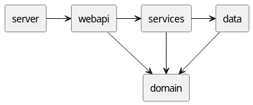

# Project Technical Report


## 1) Overview

This project implements a Kotlin backend for house rental management, with an HTTP API, domain rules (users, locations, houses, bookings), in-memory and PostgreSQL persistence, and a test suite (unit and integration tests).

## 2) Current code status (factual observation)

- The code was analyzed on the current branch exactly as it is in the repository.
- The command `./gradlew compileKotlin` runs successfully.

```text
Retornando Starting a Gradle Daemon, 1 incompatible and 3 stopped Daemons could not be reused, use --status for details
BUILD SUCCESSFUL in 16s
1 actionable task: 1 executed
```

Regarding the code, `./gradlew compileKoltin` resolves dependencies
and validates the configuration before compiling,
but it does not start the server or run tests (`test` is a different task).

## 3) API architecture and flow (priority)

### 3.1 Main flow

1. `main.app.App.kt` starts the HTTP server and chooses the data mode (memory or database).
2. `main.api.http_server.HousesRouter` starts Undertow on the configured port.
3. `main.api.http_server.HousesWebApi` receives requests, validates HTTP input (path/query/body), transforms it into DTOs, and calls services.
4. `main.api.http_server.HousesServices` orchestrates use cases, authentication/authorization, and domain <-> DTO mapping.
5. Domain services (`UsersService`, `HouseService`, `BookingService`, `LocationService`) apply business rules.
6. Repositories (`mem` or `jdbc`) persist and query data.



#### Figure 1: API flow
( The server was named Router. )

### 3.2 Layers and responsibilities

- **HTTP/API**: routing, JSON parsing, HTTP parameter validation, response codes, uniform error handling.
- **Application services (`HousesServices`)**: coordination between domain services and API DTOs.
- **Domain services**: business validations and invariants.
- **Data layer**: in-memory and PostgreSQL storage.

### 3.3 Authentication and authorization

- Token expected in the header `Authorization: Bearer <uuid>`.
- Parsing and validation in `main/api/utils/Auth.kt`.
- Operations that require a token:
    - `POST /users`
    - `PUT /users/{uid}`
    - `DELETE /users/{uid}`
    - `POST /locations`
    - `PUT /locations/{lid}`
    - `DELETE /locations/{lid}`
    - `GET /houses/mine`
    - `POST /houses`
    - `PUT /houses/{hid}`
    - `DELETE /houses/{hid}`
    - `POST /bookings`
    - `GET /bookings`
    - `GET /bookings/{bid}`
    - `PUT /bookings/{bid}`
    - `DELETE /bookings/{bid}`

- Business Rules:
    - Only the listing owner can update/delete a house.
    - Only the house owner or the user who booked it can access/update/delete a booking.
    - `GET /bookings` requires the token to belong to the owner of the requested house.
    - `POST /users` requires a valid token from an already existing user.

### 3.4 Pagination

- Implemented in `main/api/utils/Paging.kt`.
- Query params: `skip` and `limit`.
- Defaults: `skip=0`, `limit=20`.
- Limits: `skip >= 0`, `1 <= limit <= 100`.
- Applied to list endpoints that call `.page(...)`.

### 3.5 HTTP error handling

In `HousesWebApi.safe(...)`:

- `UnauthorizedException` -> `401 Unauthorized`
- `NoUserExist`, `NoHouseExist`, `NoLocationExist`, `NoBookingExist` -> `404 Not Found`
- `SerializationException`, `DomainErrorException`, `IllegalArgumentException` -> `400 Bad Request`
- `ServerErrorException` and remaining exceptions -> `500 Internal Server Error`

Error format:

```json
{
  "status": 400,
  "error": "message"
}
```

## 4) Detailed HTTP API

Base path: `/`

Expected Content-Type for JSON body: `application/json`.

### 4.1 Users

| Method | Endpoint | Auth | Request | Response |
|---|---|---|---|---|
| POST | `/users` | Yes | `CreateUserRequest{name,email}` | `201 CreateUserResponse{id,name,email,token}` |
| GET | `/users` | No | optional query `skip`,`limit` | `200 ListUsersResponse{users[]}` |
| GET | `/users/{uid}` | No | path `uid` | `200 GetUserResponse{id,name,email}` |
| PUT | `/users/{uid}` | Yes | `UpdateUserRequest{name,email}` | `200 GetUserResponse` |
| DELETE | `/users/{uid}` | Yes | optional body `DeleteUserRequest{id}` (if present, it must match the path) | `200 DeleteUserResponse{id,deleted}` |

### 4.2 Locations

| Method | Endpoint | Auth | Request | Response |
|---|---|---|---|---|
| POST | `/locations` | Yes | `CreateLocationRequest{name,type,parentId?}` | `201 CreateLocationResponse{id,name,type,parentId}` |
| GET | `/locations` | No | no body | `200 ListLocationsResponse{locations[]}` |
| GET | `/locations/{lid}` | No | path `lid` | `200 GetLocationResponse{id,name,type,parentId,fullPath[]}` |
| PUT | `/locations/{lid}` | Yes | `UpdateLocationRequest{name,type,parentId?}` | `200 GetLocationResponse` |
| DELETE | `/locations/{lid}` | Yes | optional body `DeleteLocationRequest{id}` (if present, it must match the path) | `200 DeleteLocationResponse{id,deleted}` |
| GET | `/locations/{lid}/childrenAll` | No | path `lid` | `200 List<LocationSummary>` |
| GET | `/locations/{lid}/childrenDirect` | No | path `lid` | `200 List<LocationSummary>` |
| GET | `/locations/{lid}/path` | No | path `lid` | `200 List<LocationPathEntry>` |

Hierarchy rules (domain service):

- `COUNTRY` cannot have a parent.
- Valid child types depend on the hierarchy level.
- A cycle cannot be created.
- A location with children cannot be deleted.

### 4.3 Houses

| Method | Endpoint | Auth | Request | Response |
|---|---|---|---|---|
| GET | `/houses` | No | optional query `skip`,`limit` | `200 ListHousesResponse{houses[]}` |
| GET | `/houses/mine` | Yes | Bearer header + optional query `skip`,`limit` | `200 ListHousesResponse{houses[]}` |
| POST | `/houses` | Yes | `CreateHouseRequest{title,lid,areaSqMt,pricePerNight,description}` | `201 CreateHouseResponse{...}` |
| GET | `/houses/available` | No | required query `startDate`,`endDate`; optional `skip`,`limit` | `200 ListAvailableHousesResponse{houses[]}` |
| GET | `/houses/{hid}` | No | path `hid` | `200 GetHouseResponse{...}` |
| PUT | `/houses/{hid}` | Yes | `UpdateHouseRequest{...}` | `200 GetHouseResponse` |
| DELETE | `/houses/{hid}` | Yes | optional body `DeleteHouseRequest{id}` (if present, it must match the path) | `200 DeleteHouseResponse{id,deleted}` |

Current behavior observation:

- `GET /houses` returns houses available in the interval `[today, tomorrow)` (it does not list "all" houses in the current service state).

### 4.4 Bookings

| Method | Endpoint | Auth | Request | Response |
|---|---|---|---|---|
| POST | `/bookings` | Yes | `CreateBookingRequest{hid,startDate,endDate}` | `201 CreateBookingResponse{...}` |
| GET | `/bookings` | Yes | required query `hid`,`dateStart`,`dateEnd`; optional `skip`,`limit` | `200 ListBookingsResponse{bookings[]}` |
| GET | `/bookings/{bid}` | Yes | path `bid` | `200 GetBookingResponse{...}` |
| PUT | `/bookings/{bid}` | Yes | `UpdateBookingRequest{hid,startDate,endDate}` | `200 GetBookingResponse` |
| DELETE | `/bookings/{bid}` | Yes | optional body `DeleteBookingRequest{id}` (if present, it must match the path) | `200 DeleteBookingResponse{id,deleted}` |

Booking rules:

- Required date format: `YYYY-MM-DD`.
- `endDate` must be greater than `startDate`.
- There cannot be overlap for the same house.

## 5) DTO contracts (API)

### 5.1 Request DTOs

- `CreateUserRequest`, `UpdateUserRequest`, `DeleteUserRequest`
- `CreateLocationRequest`, `UpdateLocationRequest`, `DeleteLocationRequest`
- `CreateHouseRequest`, `UpdateHouseRequest`, `DeleteHouseRequest`
- `CreateBookingRequest`, `UpdateBookingRequest`, `DeleteBookingRequest`

### 5.2 Response DTOs

- User: `CreateUserResponse`, `GetUserResponse`, `DeleteUserResponse`, `ListUsersResponse`
- Location: `CreateLocationResponse`, `GetLocationResponse`, `DeleteLocationResponse`, `ListLocationsResponse`, `LocationSummary`, `LocationPathEntry`
- House: `CreateHouseResponse`, `GetHouseResponse`, `DeleteHouseResponse`, `ListHousesResponse`
- Booking: `CreateBookingResponse`, `GetBookingResponse`, `DeleteBookingResponse`, `ListBookingsResponse`, `ListAvailableHousesResponse`, `AvailableHouseResponse`
- Error: `ApiError`

## 6) Folder and file structure

### 6.1 Project root

| Folder/File | Function |
|---|---|
| `build.gradle.kts` | Gradle build, dependencies (http4k, Kotlin serialization, PostgreSQL), Docker and test tasks. |
| `docker-compose.yml` | Local PostgreSQL container (`houses-db`, host port `5433`). |
| `.env` | Database variables (`JDBC_DATABASE_URL`, `DATABASE_USER`, `DATABASE_PASS`, etc.). |
| `gradlew`, `gradlew.bat`, `gradle/wrapper/*` | Gradle wrapper for build/test/run. |
| `Phase1.md` | Functional and non-functional requirements for the project phase. |
| `README.md` | This report. |
| `src/main/` | Main application code. |
| `src/test/` | Unit and integration tests + supporting SQL. |

### 6.2 `src/main/kotlin/main` (file by file)

#### App/config

| File | Function |
|---|---|
| `main/app/App.kt` | Entry point; reads `PORT` and `JDBC_DATABASE_URL`, creates services, and starts the server. |
| `main/app/config/EnvLoader.kt` | Optional `.env` loader, helpers for settings, and `PGSimpleDataSource` (used in the prediction module). |

#### HTTP API

| File | Function |
|---|---|
| `main/api/http_server/housesRouter.kt` | Encapsulates Undertow server startup. |
| `main/api/http_server/housesWebApi.kt` | Defines all routes, request parsing, response serialization, and HTTP error mapping. |
| `main/api/http_server/housesServices.kt` | API use cases; validates auth/authorization and calls domain services. |
| `main/api/http_server/housesDataMem.kt` | Dependency wiring; chooses `InMemory` vs `JDBC` depending on `JDBC_DATABASE_URL`. |
| `main/api/utils/Auth.kt` | UUID Bearer token parsing/validation. |
| `main/api/utils/Paging.kt` | Pagination model + extension to paginate lists. |
| `main/api/errors/ApiErrors.kt` | HTTP error DTO (`status`, `error`). |

#### DTOs

| File | Function |
|---|---|
| `main/api/dto/UserDtos.kt` | Request/response contracts for users. |
| `main/api/dto/LocationDtos.kt` | Request/response contracts for locations. |
| `main/api/dto/HouseDtos.kt` | Request/response contracts for houses. |
| `main/api/dto/BookingDtos.kt` | Request/response contracts for bookings and available houses. |

#### Domain

| File | Function |
|---|---|
| `main/domain_model/user/User.kt` | `User` entity and `Name`, `Email` value objects. |
| `main/domain_model/user/UsersService.kt` | User rules (creation, email uniqueness, update/delete, listing). |
| `main/domain_model/location/Location.kt` | `Location` entity, `LocationType`, base type/hierarchy rules. |
| `main/domain_model/location/LocationService.kt` | Location rules (hierarchy, cycle, path, children, update/delete). |
| `main/domain_model/house/House.kt` | `House` entity and `Title` value object. |
| `main/domain_model/house/HouseService.kt` | House rules (area/price/description validation, CRUD). |
| `main/domain_model/booking/Booking.kt` | `Booking` entity and `Date` value object. |
| `main/domain_model/booking/BookingService.kt` | Booking rules (dates, overlap, availability, CRUD). |
| `main/domain_model/prediction/linearPreviewHouses.kt` | Optional linear regression module for price prediction using repository/database/fallback data. |

#### Data layer

| File | Function |
|---|---|
| `main/data/interfaces/Repository.kt` | Generic repository interface. |
| `main/data/interfaces/UsersRepository.kt` | User persistence contract. |
| `main/data/interfaces/HouseRepository.kt` | House persistence contract. |
| `main/data/interfaces/BookingRepository.kt` | Booking persistence contract. |
| `main/data/interfaces/LocationRepository.kt` | Location persistence contract (with hierarchical methods). |
| `main/data/impl/mem/InMemoryUsersRepository.kt` | In-memory repository for users (indexes by id/token/email). |
| `main/data/impl/mem/InMemoryHouseRepository.kt` | In-memory repository for houses. |
| `main/data/impl/mem/InMemoryBookingRepository.kt` | In-memory repository for bookings. |
| `main/data/impl/mem/InMemoryLocationRepository.kt` | In-memory repository for locations (children/path/exists). |
| `main/data/impl/jdbc/JdbcUsersRepository.kt` | JDBC persistence for users (CRUD + getByToken/email). |
| `main/data/impl/jdbc/JdbcHouseRepository.kt` | JDBC persistence for houses. |
| `main/data/impl/jdbc/JdbcBookingRepository.kt` | JDBC persistence for bookings. |
| `main/data/impl/jdbc/JdbcLocationRepository.kt` | JDBC persistence for locations with recursive queries (path/children). |

#### Utilities and errors

| File | Function |
|---|---|
| `main/utils/BookingDateUtils.kt` | Booking date parsing/formatting/overlap. |
| `main/errors/TTTErrorException.kt` | Exception hierarchy for domain/server/repository/authorization/not found errors. |

### 6.3 Other folders in `src/main`

| Folder/File | Function |
|---|---|
| `src/main/kotlin/sql/createSchema.sql` | SQL script to create the PostgreSQL schema (users, locations, houses, booking, and indexes). |

### 6.4 `src/test` (file by file)

#### HTTP API

| File | Function |
|---|---|
| `src/test/kotlin/http_server/HousesWebApiTest.kt` | HTTP endpoint tests (invalid JSON, users CRUD, etc.). |
| `src/test/kotlin/http_server/HousesServicesTest.kt` | Tests for the `HousesServices` layer. |
| `src/test/kotlin/http_server/HousesRouterTest.kt` | Tests port binding and request serving. |
| `src/test/kotlin/http_server/HousesDataMemTest.kt` | Tests backend selection: mem vs jdbc. |

#### Domain/API by module

| File | Function |
|---|---|
| `src/test/kotlin/domain_model/user/UsersApiTest.kt` | User API tests (status codes, validations). |
| `src/test/kotlin/domain_model/user/UsersServiceTest.kt` | User business rules. |
| `src/test/kotlin/domain_model/location/LocationApiTest.kt` | Location API tests (hierarchy, path, delete). |
| `src/test/kotlin/domain_model/location/LocationServiceTest.kt` | Location business rules. |
| `src/test/kotlin/domain_model/house/HouseApiTest.kt` | House API tests (auth, ownership, availability). |
| `src/test/kotlin/domain_model/house/HouseServiceTest.kt` | House service rules. |
| `src/test/kotlin/domain_model/booking/BookingApiTest.kt` | Booking API tests (auth, overlap, queries). |
| `src/test/kotlin/domain_model/booking/BookingServiceTest.kt` | Booking service rules. |

#### In-memory repositories

| File | Function |
|---|---|
| `src/test/kotlin/repos/mem/InMemoryUsersRepositoryTest.kt` | Indexes and CRUD for in-memory users. |
| `src/test/kotlin/repos/mem/InMemoryHouseRepositoryTest.kt` | CRUD for in-memory houses. |
| `src/test/kotlin/repos/mem/InMemoryBookingRepositoryTest.kt` | CRUD for in-memory bookings. |
| `src/test/kotlin/repos/mem/InMemoryLocationRepositoryTest.kt` | Hierarchy and CRUD for in-memory locations. |

#### JDBC repositories and integration

| File | Function |
|---|---|
| `src/test/kotlin/repos/jdbc/PostgresTestContainer.kt` | Base test class with PostgreSQL Testcontainers and init schema. |
| `src/test/kotlin/repos/jdbc/JdbcUsersRepositoryTest.kt` | CRUD + user constraints in JDBC. |
| `src/test/kotlin/repos/jdbc/JdbcHouseRepositoryTest.kt` | CRUD + foreign keys for houses in JDBC. |
| `src/test/kotlin/repos/jdbc/JdbcBookingRepositoryTest.kt` | JDBC bookings CRUD. |
| `src/test/kotlin/repos/jdbc/JdbcLocationRepositoryTest.kt` | JDBC hierarchy/path/children for locations. |
| `src/test/kotlin/repos/jdbc/JdbcRepositoryIntegrationTest.kt` | Integrated multi-entity and cascade scenarios. |

#### Linear prediction

| File | Function |
|---|---|
| `src/test/kotlin/linear_preview/PricePreviewTest.kt` | Tests for the linear regression module. |

#### Pagination utilities and manual requests

| File | Function |
|---|---|
| `src/test/kotlin/main/ls/api/utils/PagingOfTest.kt` | Parse/validation tests for `Paging.of`. |
| `src/test/kotlin/main/ls/api/utils/PagingPageTest.kt` | Tests for the `List<T>.page` extension. |
| `src/test/kotlin/main/ls/api/utils/PagingIntegrationTest.kt` | Pagination integration tests in routes/listings. |
| `src/test/kotlin/main/ls/test.http` | Collection of HTTP requests for manual testing. |

#### Test SQL

| File | Function |
|---|---|
| `src/test/resources/sql/createSchema.sql` | Base schema for JDBC tests. |
| `src/test/resources/sql/insert_locs_for_test.sql` | Script to insert location data for test scenarios. |

## 7) How to run the project locally

### 7.1 Prerequisites

- JDK compatible with the project's Gradle/Kotlin version.
- Docker (if using PostgreSQL in a container).

### 7.2 Startup with PostgreSQL (project intention)

1. Start the database:

```bash
./gradlew allUp
```

or

```bash
docker compose up -d
```

2. Export variables (or make sure the shell already has them):

```bash
export JDBC_DATABASE_URL=jdbc:postgresql://localhost:5433/houses
export DATABASE_USER=houses
export DATABASE_PASS=houses
```

3. Start the application:

```bash
./gradlew run
```

Note: `App.kt` reads variables from the process environment; it does not load `.env` directly.

### 7.3 In-memory startup

- If `JDBC_DATABASE_URL` is not defined, `HousesDataMem` uses `InMemory` repositories.

## 8) How to test the API

### 8.1 Automated tests

```bash
./gradlew test
```

### 8.2 Quick manual test with `curl`

Create user:

```bash
curl -s -X POST http://localhost:8080/users \
  -H 'Authorization: Bearer <EXISTING_TOKEN>' \
  -H 'Content-Type: application/json' \
  -d '{"name":"Alice","email":"alice@example.com"}'
```

Note: in the current state, `POST /users` requires a valid token from an already existing user.

Create house (with Bearer token):

```bash
curl -s -X POST http://localhost:8080/houses \
  -H 'Authorization: Bearer <TOKEN>' \
  -H 'Content-Type: application/json' \
  -d '{"title":"Blue House","lid":"<LOCATION_UUID>","areaSqMt":120,"pricePerNight":95.0,"description":"House near the beach"}'
```

List available houses:

```bash
curl -s "http://localhost:8080/houses/available?startDate=2026-06-10&endDate=2026-06-12"
```

## 9) Relevant environment variables

| Variable | Use | Default in code | Required |
|---|---|---|---|
| `PORT` | HTTP server port | `8080` | No |
| `JDBC_DATABASE_URL` | Enables JDBC backend and defines DB URL | no default | No (if absent, uses memory) |
| `DATABASE_USER` | DB user for `createDataSource` | falls back to `DATABASE_NAME` | Depends on `createDataSource` usage |
| `DATABASE_NAME` | Fallback user in `createDataSource` | no default | Only if `DATABASE_USER` is absent |
| `DATABASE_PASS` | DB password for `createDataSource` | no default | Yes when `createDataSource` is used |

## 10) Final short summary

The complete architecture was documented (HTTP -> services -> domain -> repositories), along with the relevant folder/file structure and all main API contracts, prioritizing endpoints, authentication, validations, and error handling.

Most critical files for the API:

- `src/main/kotlin/main/api/http_server/housesWebApi.kt`
- `src/main/kotlin/main/api/http_server/housesServices.kt`
- `src/main/kotlin/main/api/http_server/housesDataMem.kt`
- `src/main/kotlin/main/api/utils/Auth.kt`
- `src/main/kotlin/main/api/utils/Paging.kt`
- `src/main/kotlin/main/domain_model/*/*Service.kt`

### Developers
#### Kauã Borges -> Full stack

This project is mainly an academic training exercise, developed for learning and practice purposes, and it is not intended to be a fully professional product or a production-ready service for public release.

