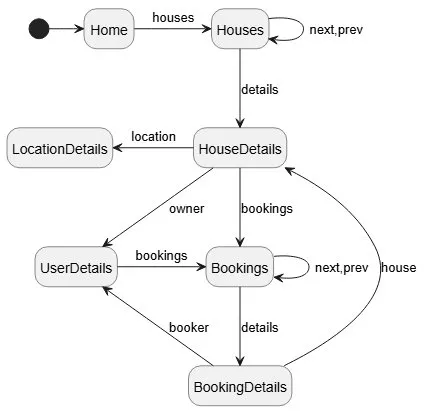

# Relatório Técnico do Projeto

### Developers

Kauã Borges

Versão de entrega: `1.1.0`

## 1. Resumo Executivo

O projeto implementa uma plataforma de arrendamento de casas composta por:

- backend HTTP em Kotlin sobre `http4k` e `Undertow`;
- camada de domínio separada por módulos (`users`, `locations`, `houses`, `bookings`);
- persistência com dupla implementação: repositórios em memória e repositórios JDBC para PostgreSQL;
- SPA em JavaScript modular servida pelo mesmo processo HTTP;
- testes automatizados em Kotlin e em JavaScript;
- extensões atuais do projeto: autenticação por email e password, sessão bootstrap de demonstração, cache de casas com limite de tamanho, predição linear de preço, calendário mensal de disponibilidade e deploy Docker/Render.

O servidor expõe:

- API REST em `/api/*`;
- SPA e conteúdo estático em `/`.

## 2. Funcionalidades Implementadas

Na versão final, a aplicação inclui as seguintes funcionalidades principais:

- autenticação com email/password e sessão por token;
- criação, consulta, atualização e remoção de utilizadores;
- gestão hierárquica de localizações;
- criação, consulta, atualização e remoção de anúncios de casas;
- pesquisa de casas disponíveis por intervalo, localização e texto;
- listagem de casas do utilizador autenticado;
- criação, consulta, atualização e remoção de reservas;
- listagem de reservas por casa, intervalo e utilizador autenticado;
- calendário mensal de disponibilidade por casa;
- previsão de preço por regressão linear;
- estatísticas da cache de casas;
- SPA com navegação por hash, formulários de gestão e persistência local da sessão;
- imagem Docker publicada em Docker Hub e Web Service configurado no Render.

## 3. Arquitetura Global


Figura 1 - Organização geral da aplicação entre servidor HTTP, camada Web API, serviços, domínio e persistência.

### 3.1 Fluxo principal de execução

1. `main.app.AppKt` lê configuração de ambiente e `.env`.
2. `HousesDataMem.services(...)` decide a infraestrutura de dados.
3. `DatabaseSchemaInitializer.ensureSchema(...)` prepara o schema quando há PostgreSQL.
4. `HousesWebApi` define as rotas HTTP e a serialização JSON.
5. `HousesRouter` publica `/api` e monta a SPA na raiz.
6. A SPA faz chamadas `fetch` para a API e renderiza vistas dinamicamente.

### 3.2 Camadas

#### Entry point e configuração

- `src/main/kotlin/main/app/App.kt`
  - inicia a aplicação;
  - resolve `PORT`, `JDBC_DATABASE_URL`, `DATABASE_USER`, `DATABASE_PASS`;
  - arranca `HousesRouter`.
- `src/main/kotlin/main/app/config/EnvLoader.kt`
  - lê `.env` a partir da raiz do projeto;
  - permite fallback entre variáveis do processo e ficheiro `.env`;
  - constrói `PGSimpleDataSource`.

#### API HTTP

- `src/main/kotlin/main/api/httpServer/HousesRouter.kt`
  - expõe `/api` para backend;
  - expõe `/` para SPA;
  - aplica CORS permissivo para `content-type` e `authorization`;
  - resolve a diretoria `static-content` dinamicamente.
- `src/main/kotlin/main/api/httpServer/HousesWebApi.kt`
  - declara todas as rotas;
  - faz parsing de `path`, `query`, `Authorization` e corpo JSON;
  - converte exceções em respostas HTTP uniformes.
- `src/main/kotlin/main/api/httpServer/HousesServices.kt`
  - orquestra casos de uso;
  - valida permissões;
  - converte DTOs para chamadas de domínio;
  - concentra funcionalidades adicionais como bootstrap demo, cache stats e predição.

#### Domínio

- `UsersService`
  - criação, listagem, atualização, remoção;
  - unicidade de email;
  - validação de password e armazenamento por hash SHA-512;
  - autenticação por email/password;
  - obtenção por email, id ou token.
- `LocationService`
  - gestão hierárquica;
  - validação de tipos pai-filho;
  - prevenção de ciclos;
  - recuperação de `path`, filhos diretos e todos os descendentes.
- `HouseService`
  - validação de área, preço e descrição;
  - CRUD de anúncios;
  - cache de acesso a casas por `id`.
- `BookingService`
  - criação, atualização, remoção e consulta;
  - validação de datas;
  - prevenção de overlaps;
  - cálculo de disponibilidade por intervalo e por mês.
- `main.domain.prediction.LinearPreviewHouses.kt`
  - treino de modelo linear;
  - seleção da fonte de treino;
  - previsão de preço por área.

#### Persistência

- Implementações em memória:
  - `InMemoryUsersRepository`
  - `InMemoryLocationRepository`
  - `InMemoryHouseRepository`
  - `InMemoryBookingRepository`
- Implementações JDBC:
  - `JdbcUsersRepository`
  - `JdbcLocationRepository`
  - `JdbcHouseRepository`
  - `JdbcBookingRepository`

## 4. Modo de Execução e Wiring

### 4.1 Seleção de backend de dados

`HousesDataMem.services(jdbcDatabaseUrl, ...)` usa sempre JDBC quando `JDBC_DATABASE_URL` está preenchido. Se a string vier vazia, a aplicação pode continuar com repositórios em memória através do objeto `HousesDataMem.services`.

### 4.2 Inicialização da base de dados

Quando o backend JDBC é usado:

- cria-se um `PGSimpleDataSource`;
- corre-se `DatabaseSchemaInitializer.ensureSchema(dataSource)`;
- os repositórios JDBC passam a ser a fonte de verdade.

### 4.3 Cache de casas

Existe um cache explícito em `main.data.impl.caches.HouseInfoCache`:

- chave: `Uuid` da casa;
- valor: entidade `House`;
- estratégia: fila baseada em `ArrayDeque` com refresh no acesso;
- remoção do elemento mais antigo quando o limite é atingido;
- métricas: `hits`, `misses`, `size`, `limit`.

O limite é controlado por:

- `HOUSE_CACHE_SIZE`, quando definido e maior que zero;
- `100`, por omissão.

## 5. API HTTP Atual

Base URL lógica:

- `http://localhost:8080/api`

### 5.1 Sessão

#### `GET /api/session/bootstrap`

Cria ou reutiliza um cenário de demonstração:

- utilizador demo;
- localização `COUNTRY`;
- uma casa livre;
- uma casa ocupada;
- uma reserva ativa na casa ocupada para `[hoje, amanhã)`.

Retorna:

- token de autenticação;
- `userId`;
- `locationId`;
- `freeHouseId`;
- `busyHouseId`;
- `role`.

#### `POST /api/session/login`

Autenticação por credenciais:

- recebe `{ "email": "...", "password": "..." }`;
- procura o utilizador pelo email;
- valida a password recebida contra o hash guardado;
- devolve a sessão completa com token.

### 5.2 Users

Endpoints ativos:

- `POST /api/users`
- `GET /api/users`
- `GET /api/users/{uid}`
- `PUT /api/users/{uid}`
- `DELETE /api/users/{uid}`

Notas técnicas relevantes:

- `POST /api/users` é público no código atual;
- `POST /api/users` recebe `name`, `email` e `password`;
- a password nunca é devolvida em respostas HTTP;
- a persistência guarda apenas `password_hash`;
- passwords fracas são rejeitadas por validação de domínio;
- `PUT` e `DELETE` apenas exigem token válido, mas não verificam que o token pertence ao `uid` da rota;
- `role` existe na entidade e nas respostas, mas o fluxo público atual cria utilizadores apenas com `USER`.

### 5.3 Locations

Endpoints ativos:

- `POST /api/locations`
- `GET /api/locations`
- `GET /api/locations/getCountries`
- `GET /api/locations/{lid}`
- `PUT /api/locations/{lid}`
- `DELETE /api/locations/{lid}`
- `GET /api/locations/{lid}/childrenAll`
- `GET /api/locations/{lid}/childrenDirect`
- `GET /api/locations/{lid}/path`

Regras implementadas:

- `COUNTRY` não pode ter `parentId`;
- tipos não-`COUNTRY` exigem pai existente;
- a hierarquia é validada por `LocationType.isAllowedChild(...)`;
- atualização não pode criar ciclos;
- não é permitido apagar localizações com descendentes;
- nomes de localização são tratados como únicos de forma case-insensitive no serviço.

### 5.4 Houses

Endpoints ativos:

- `GET /api/houses`
- `GET /api/houses/mine`
- `POST /api/houses`
- `GET /api/houses/available`
- `GET /api/houses/preview`
- `GET /api/houses/cache/stats`
- `GET /api/houses/{hid}`
- `PUT /api/houses/{hid}`
- `DELETE /api/houses/{hid}`
- `GET /api/houses/{hid}/available-days`

Comportamentos relevantes:

- `GET /api/houses` não devolve todas as casas; devolve apenas as disponíveis no intervalo `[hoje, amanhã]`;
- `GET /api/houses/available` suporta filtros opcionais como `locationId` e `search`;
- quando o pedido inclui token, as listagens de disponibilidade podem excluir casas do próprio utilizador;
- `POST /api/houses` exige autenticação e obriga a que `lid` seja do tipo `LOCALITY`;
- `PUT /api/houses/{hid}` e `DELETE /api/houses/{hid}` exigem que o token pertença ao dono da casa;
- `DELETE /api/houses/{hid}` falha se existirem bookings associados;
- `GET /api/houses/preview?areaSqMt=N` usa regressão linear treinada dinamicamente;
- `GET /api/houses/cache/stats` expõe telemetria do cache;
- `GET /api/houses/{hid}/available-days?year=YYYY&month=MM` devolve os dias livres do mês.

### 5.5 Bookings

Endpoints ativos:

- `POST /api/bookings`
- `GET /api/bookings`
- `GET /api/bookings/mine`
- `GET /api/bookings/{bid}`
- `PUT /api/bookings/{bid}`
- `DELETE /api/bookings/{bid}`

Regras implementadas:

- `startDate` e `endDate` usam formato ISO `YYYY-MM-DD`;
- `endDate` tem de ser estritamente posterior a `startDate`;
- não pode existir overlap para a mesma casa;
- `GET /api/bookings` exige `hid`, `dateStart` e `dateEnd`;
- `GET /api/bookings` apenas pode ser executado pelo dono da casa;
- `GET /api/bookings/{bid}` pode ser usado pelo booker ou pelo dono da casa;
- `PUT` e `DELETE` de booking só podem ser executados pelo utilizador que fez a reserva.

## 6. Paginação

Implementada em `src/main/kotlin/main/api/utils/Paging.kt`.

Parâmetros:

- `skip` com default `0`;
- `limit` com default `20`;
- `limit` máximo `100`.

É usada em listagens como:

- `GET /users`
- `GET /locations`
- `GET /houses`
- `GET /houses/mine`
- `GET /houses/available`
- `GET /bookings`
- `GET /bookings/mine`

## 7. Erros e Contrato HTTP

### 7.1 Serialização

`HousesWebApi` usa `kotlinx.serialization` com:

- `Json { ignoreUnknownKeys = true }`

Isto significa que campos extra no body JSON são ignorados, mas campos em falta ou tipos inválidos continuam a gerar erro.

### 7.2 Mapeamento de erros

O método `safe { ... }` de `HousesWebApi` converte exceções para:

- `401 Unauthorized`
  - `UnauthorizedException`
- `404 Not Found`
  - `NoUserExist`
  - `NoHouseExist`
  - `NoLocationExist`
  - `NoBookingExist`
- `400 Bad Request`
  - `SerializationException`
  - `DomainErrorException`
  - `IllegalArgumentException`
  - `LidNotLocatityException`
- `500 Internal Server Error`
  - restantes exceções

Formato:

```json
{
  "status": 400,
  "error": "mensagem"
}
```

## 8. DTOs e Contratos

### 8.1 Sessão e utilizador

- `CreateUserRequest`
- `LoginUserRequest`
- `UpdateUserRequest`
- `DeleteUserRequest`
- `UserSessionResponse`
- `BootstrapSessionResponse`
- `GetUserResponse`
- `ListUsersResponse`

Contratos principais:

- `CreateUserRequest(name, email, password)`
- `LoginUserRequest(email, password)`
- `UserSessionResponse(id, name, email, token, role)`

### 8.2 Localização

- `CreateLocationRequest`
- `UpdateLocationRequest`
- `DeleteLocationRequest`
- `CreateLocationResponse`
- `GetLocationResponse`
- `ListLocationsResponse`
- `LocationSummary`
- `LocationPathEntry`

### 8.3 Casa

- `CreateHouseRequest`
- `UpdateHouseRequest`
- `DeleteHouseRequest`
- `CreateHouseResponse`
- `GetHouseResponse`
- `ListHousesResponse`
- `HousePricePreviewResponse`
- `HouseCacheStatsResponse`

### 8.4 Booking e disponibilidade

- `CreateBookingRequest`
- `UpdateBookingRequest`
- `DeleteBookingRequest`
- `CreateBookingResponse`
- `GetBookingResponse`
- `ListBookingsResponse`
- `ListAvailableHousesResponse`
- `ListAvailableHouseDaysResponse`

## 9. Persistência e Modelo de Dados

### 9.1 Entidades principais

- `User`
  - `id`
  - `name`
  - `email`
  - `passwordHash` persistido internamente
  - `token`
  - `role`
- `Location`
  - `id`
  - `name`
  - `type`
  - `parentId`
- `House`
  - `id`
  - `uid` do dono
  - `title`
  - `lid` da localização
  - `areaSqMt`
  - `pricePerNight`
  - `description`
- `Booking`
  - `id`
  - `hid`
  - `uid`
  - `startDate`
  - `endDate`

### 9.2 SQL e schema

Os scripts relevantes encontram-se em:

- `src/main/resources/sql/createSchema.sql`
- `src/main/resources/sql/insertLocation.sql`
- `src/test/resources/sql/createSchema.sql`
- `src/test/resources/sql/insert_locs_for_test.sql`

O projeto usa PostgreSQL com tabelas para:

- `users`
- `locations`
- `houses`
- `booking`

O script `createSchema.sql` usa `CREATE TABLE IF NOT EXISTS`; portanto cria a estrutura inicial, mas não substitui migrações quando uma tabela antiga já existe com colunas em falta. O script `insertLocation.sql` popula a hierarquia base de localizações e é idempotente para nomes já existentes.

Os testes JDBC usam Testcontainers para validar o comportamento dos repositórios contra PostgreSQL real.

## 10. Predição Linear de Preço

O endpoint `GET /api/houses/preview` é suportado por `main.domain.prediction.LinearPreviewHouses.kt`.

### 10.1 Fonte dos dados de treino

O pipeline tenta carregar amostras por esta ordem:

1. PostgreSQL, se `JDBC_DATABASE_URL` existir e a leitura funcionar;
2. repositório em memória;
3. `fallbackHouses`, embutido no código.

### 10.2 Processo

1. recolha de pares `(area, price)`;
2. normalização min-max de área e preço;
3. treino com gradiente descendente;
4. previsão do preço para a área pedida;
5. arredondamento para `Long`.

### 10.3 Resposta devolvida

- área consultada;
- preço previsto;
- fonte de treino usada;
- número de amostras;
- peso e bias do modelo.

## 11. SPA Atual



Figura 2 - Navegação principal da interface Web entre listagens, detalhes de casas, utilizadores, localizações e reservas.

### 11.1 Estrutura

O frontend encontra-se em `static-content/`.

Ficheiros relevantes:

- `static-content/index.html`
- `static-content/indexSPA.js`
- `static-content/router/router.js`
- `static-content/dsl/dsl.js`
- `static-content/handlers/indexHandlers.js`
- `static-content/views/**/*`
- `static-content/token/tokenStorage.js`
- `static-content/api/*`
- `static-content/ui/pageComponents.js`

### 11.2 Navegação

O router é hash-based. Rotas principais registradas hoje:

- `#home`
- `#dashboard`
- `#houses`
- `#houses/available`
- `#houses/avaliable` alias mantido por compatibilidade
- `#houses/preview`
- `#houses/cache`
- `#houses/mine`
- `#houses/:hid`
- `#houses/:hid/bookings`
- `#houses/:hid/available-days`
- `#locations`
- `#locations/:lid`
- `#locations/:lid/childrenAll`
- `#locations/:lid/childrenDirect`
- `#locations/:lid/path`
- `#users`
- `#account`
- `#users/:uid`
- `#bookings/new`
- `#bookings/mine`
- `#bookings/:bid`

### 11.3 Autenticação no cliente

`tokenStorage.js` guarda:

- token em `localStorage` (`houses.auth.token`);
- sessão serializada em `houses.auth.session`.

O cliente:

- restaura sessão em reload;
- mantém a sessão mesmo depois de fechar e reabrir o browser;
- remove a sessão local no logout;
- diferencia acesso `ADMIN` na UI através de `hasAdminAccess()`;
- sincroniza automaticamente o token quando a API devolve payload com `token`.

A escolha de `localStorage` é deliberada no projeto atual. O enunciado da fase 4 permite uma interpretação mais restrita, com validade apenas até fechar o separador/browser; aqui foi privilegiada a persistência da sessão para melhorar a experiência de uso. A decisão deve ser lida em conjunto com o botão de logout, que limpa explicitamente o estado local.

### 11.4 Fluxo da landing/auth screen

`indexSPA.js` implementa:

- criação de conta sem autenticação prévia;
- login por email e password;
- preview público de casas disponíveis;
- transição para shell autenticada após sessão válida.

### 11.5 Views funcionais

#### Houses

- pesquisa de casas;
- detalhe da casa;
- casas disponíveis por intervalo;
- casas do utilizador;
- preview de preço;
- observação de cache stats;
- dias disponíveis por mês.

#### Bookings

- criação de booking;
- bookings por casa;
- bookings do utilizador;
- detalhe/edição/remoção de booking.

#### Locations

- listagem;
- criação;
- detalhe;
- update;
- path;
- filhos diretos e transitivos.

#### Users

- listagem;
- detalhe;
- vista de conta autenticada.

## 12. Estrutura de Pastas

### 12.1 Backend Kotlin

- `src/main/kotlin/main/app`
- `src/main/kotlin/main/api`
- `src/main/kotlin/main/domain`
- `src/main/kotlin/main/data`
- `src/main/kotlin/main/errors`
- `src/main/kotlin/main/utils`

### 12.2 Frontend

- `static-content/api`
- `static-content/dsl`
- `static-content/error`
- `static-content/handlers`
- `static-content/passport`
- `static-content/router`
- `static-content/token`
- `static-content/ui`
- `static-content/views`
- `static-content/utis`

### 12.3 Testes

- `src/test/kotlin/main/api`
- `src/test/kotlin/main/domain`
- `src/test/kotlin/main/repos`
- `src/test/resources/sql`
- `static-content/tests`

## 13. Testes Automatizados

### 13.1 Backend

Cobertura relevante existente:

- API HTTP
- serviços de domínio
- paginação
- repositórios em memória
- repositórios JDBC
- integração com PostgreSQL via Testcontainers
- serving de static content
- regressão linear

Comando:

```bash
./gradlew test
```

### 13.2 Frontend

Existe suíte Node para a SPA.

Comandos:

```bash
cd static-content
npm test
```

O `package.json` usa:

- `node --test --test-concurrency=1 tests`

## 14. Execução Local

### 14.1 Com PostgreSQL

1. Subir a base de dados:

```bash
docker compose up -d
```

ou

```bash
./gradlew allUp
```

2. Configurar ambiente ou `.env`

3. Arrancar a aplicação:

```bash
./gradlew run
```

### 14.2 Em memória

O código atual chama `getRequiredSetting("JDBC_DATABASE_URL", dotEnv)` no arranque. Na prática, isso significa que a variável ou a entrada no `.env` tem de existir, mesmo que a intenção seja usar memória. Para usar efetivamente o modo em memória sem falha no arranque, é necessário rever `App.kt` ou garantir uma configuração compatível com o fluxo atual.

## 15. Variáveis de Ambiente

| Variável            | Uso                                                                   |
|---------------------|-----------------------------------------------------------------------|
| `PORT`              | Porta HTTP publicada por `HousesRouter`                               |
| `JDBC_DATABASE_URL` | URL JDBC PostgreSQL; atualmente tratada como obrigatória por `App.kt` |
| `DATABASE_USER`     | utilizador PostgreSQL                                                 |
| `DATABASE_NAME`     | fallback usado onde `DATABASE_USER` não existe                        |
| `DATABASE_PASS`     | password PostgreSQL                                                   |
| `HOUSE_CACHE_SIZE`  | limite do cache de casas                                              |

No Render, o essencial é `JDBC_DATABASE_URL`. As variáveis `DATABASE_USER`, `DATABASE_NAME` e `DATABASE_PASS` continuam úteis para execução local ou configurações separadas, mas a URL JDBC completa também pode transportar as credenciais.

## 16. Possíveis Melhoramentos

- Melhorar o CSS e tornar a interface mais consistente e responsiva.
- Adicionar fotografias às casas, principalmente na página de detalhe.
- Criar uma secção de comentários ou avaliações nas páginas das casas.
- Evoluir a página de perfil, permitindo alterar foto, dados pessoais como biografia, número de telemóvel, etc e definições da conta.
- Validar emails através de um serviço externo, como Resend, usando um domínio próprio.
- Enviar email de confirmação quando uma reserva é criada com sucesso.
- Criar um canal de contacto para suporte técnico.
- Integrar pagamentos das reservas através do Stripe.

Embora isto seja um projeto académico e estas ideias aumentem bastante o âmbito, são evoluções naturais caso a aplicação passasse de protótipo académico para produto mais completo.

## 17. Artefactos de Documentação

- especificação OpenAPI existente, sincronizada com o estado atual: `docs/openAPI.yaml`
- coleção manual de requests: `src/test/kotlin/main/test.http`
- requests de demonstração: `demonstration.http`

## 18. Conclusão

No estado atual, o projeto já não é apenas um CRUD simples. Ele combina:

- API REST com validação e paginação;
- regras de domínio não triviais;
- persistência pluggable;
- SPA funcional;
- autenticação por token;
- autenticação com password e hash persistido;
- cenário bootstrap para demonstrações;
- cache com métricas;
- predição linear de preço;
- deploy Docker/Render com PostgreSQL externo;
- testes em duas stacks.

O ponto mais importante para manutenção futura é manter a documentação sincronizada com o comportamento real das rotas e com as divergências arquiteturais já identificadas, principalmente em autenticação/autorização, modo em memória, semântica exata das listagens e configuração de produção.
